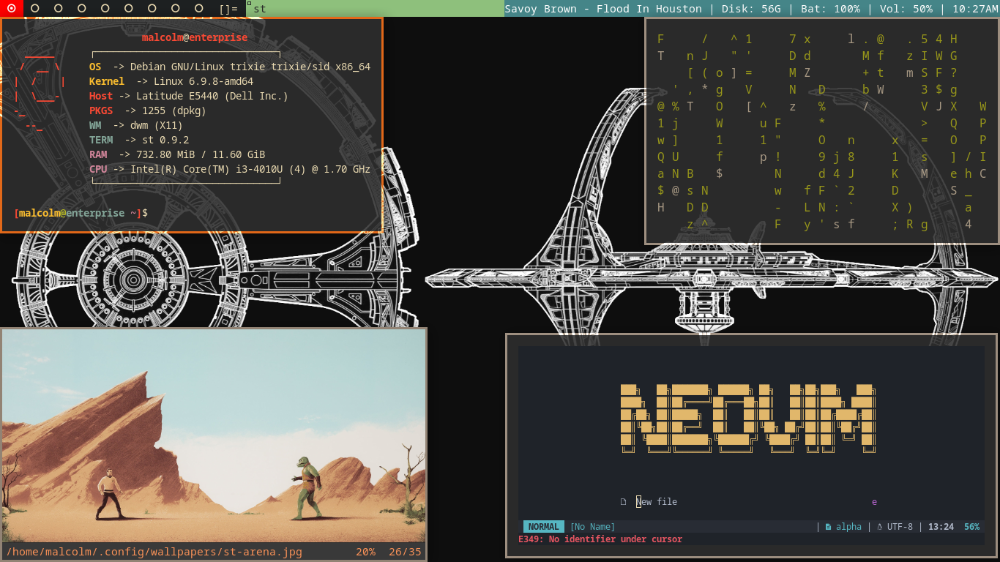

# What is this?

My Suckless Build Using dwm + st + nsxiv + fastcompmgr  
aka. my "moderately" patched Suckless Tools

# Screenshot

Picture of four st instances separately running fastfetch, cmatrix, nsxiv, neovim, and an background

# DWM

Differences
-----------
-In this DWM fork, I have streamlined the layouts to only include tile. I have also modified the 'Makefile' so that when you 'make install' or 'make uninstall', a dwm.desktop file will be added or removed from /usr/share/xsessions. 

-Furthermore, I built in a sh script inside the 'Cool Autostart' part of the 'config.h' to display [MPD/MPC Song | Disk | Battery | Volume | Date] so it removes the use of slstatus

-Lastly, I edited the config.mk compiler flags by using -O0 and other minimal flags so it compiles faster then the original

Patches
-------
The patches have been applied in the order their are listed in below
-------
dwm-restartsig-20180523-6.2.diff 
dwm-exitmenu-6.3.diff 
dwm-alttagsdecoration-2020010304-cb3f58a.diff 
dwm-fullgaps-6.4.diff 
dwm-actualfullscreen-20211013-cb3f58a.diff 
dwm-colorbar-6.3.diff 
dwm-rainbowtags-6.2.diff 
dwm-swallow-6.3.diff 
dwm-shiftviewclients-6.2.diff 
dwm-cool-autostart-20240312-9f88553.diff 

# NSXIV

Version
-------
nsxiv-v30

Differences
-----------
load-dir-3a22e6a.patch - Load all images in the current directory 
 
Compilation Time
----------------
time sudo make 
real    0m0.186s 
user    0m0.014s 
sys     0m0.005s 

time sudo make clean install 
real    0m1.197s 
user    0m0.005s 
sys     0m0.010s 

Changes
-------
-Have the Makefile only use a config.h 
-Added a patch 
-Changed the colorscheme 
-Added in keybindings to view previous and next pictures using vim keys and arrow keys 
-Added in -O0 into the config.mk CFLAGS for faster compilation time 

